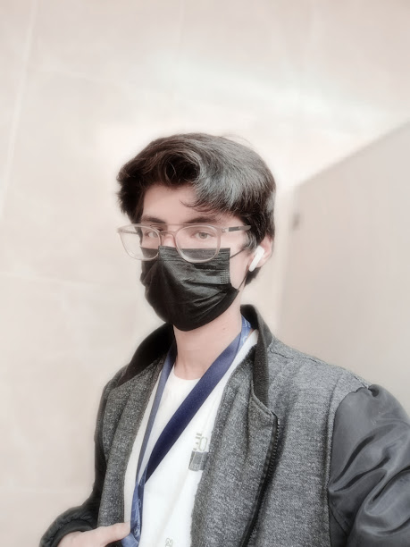

<html>
<head>
    <title style="font-size: 24px; font-family: 'Lexend', cursive;">Isaak Vidal</title>
    
</head>
<body>
	

    <h1>Bienvenido</h1>
	

    <!-- Texto de introducción -->
    
¡Hola! Mi nombre es Isaak Vidal y esta página es un tributo a mis padres.

  

    <!-- Contenedor para el texto con márgenes laterales y borde -->
    

        <!-- Texto -->
        
Este soy yo, nací el 16 de diciembre del 2002 en Estados Unidos, Indiana. Mis padres son Armando Vidal y Normallín García, siendo yo su primer hijo y hermano mayor de mis hermanos, actualmente soy estudiante de universidad y me gusta mucho el pan.

    

	

    <!-- Botón para Mamá -->
    
Mamá

    	

	

    <!-- Botón para Papá -->
    
Papá

    	

    <!-- Contenido para Mamá -->
	

    

        <h2>Mi Mamá</h2>
        
Mi mamá, Normallin Garcia, es alguien a quien he admirado mucho en todo aspecto, es quien ha estado conmigo desde toda la vida para apoyarme en mis metas. Su personalidad es muy seria y callada, pero definitivamente es afectiva a su manera. Me encanta su persecipción positiva y lógica de ver las cosas, también siempre ha sido muy comprensiva conmigo y mis hermanos en todo aspecto, por lo que siempre nos hemos sentido apoyados por ella.   

Actualmente tiene 45 años y admiro todo el esfuerzo que hace, se encarga de la casa, además de cuidar niños y a mi hermano más pequeño al mismo tiempo, definitivamente una persona trabajadora de quien tengo mucho que aprender.  

	

        
	

    

    <!-- Contenido para Papá -->
	

    

        <h2>Mi Papá</h2>
        
Mi papá, Armando Vidal es una persona muy trabajadora, de caracter fuerte y definitivamente es un buen lider. Desde que tengo memoria lo he recordado como una persona muy grande y estricta.  
A pesar de todo lo anterior, también es muy cariñoso y gracioso y trata de hallar formas de acercarse a mí y a mis hermanos. Definitivamente una persona grandiosa de la cual estoy orgulloso, una persona la cual sabe como resolver las cosas en cualquier situación.   

Actualmente tiene 42 años y trabaja como supervisor.  

	

         
	

    

    <!-- JavaScript para mostrar/ocultar el contenido -->
    

